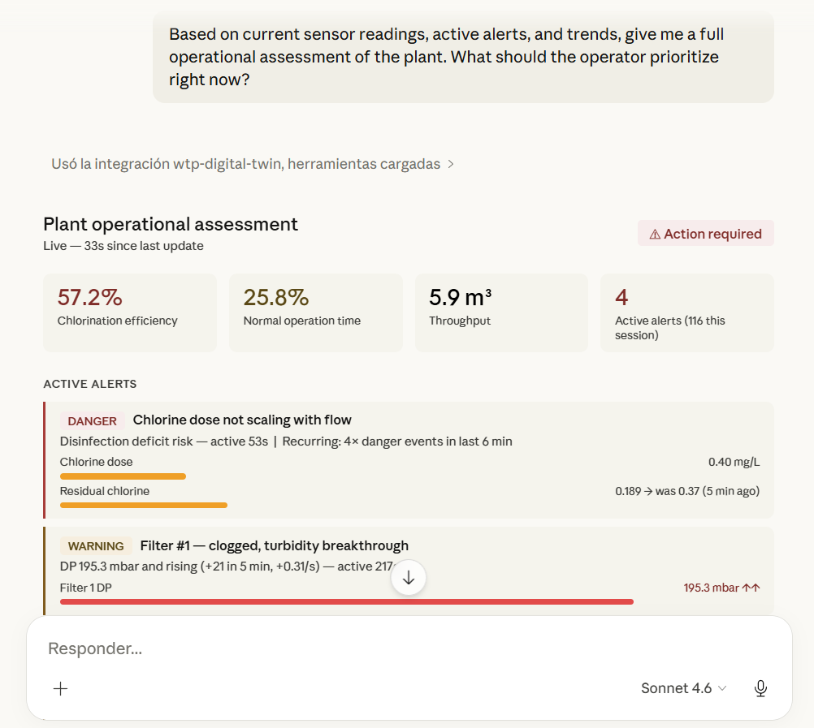
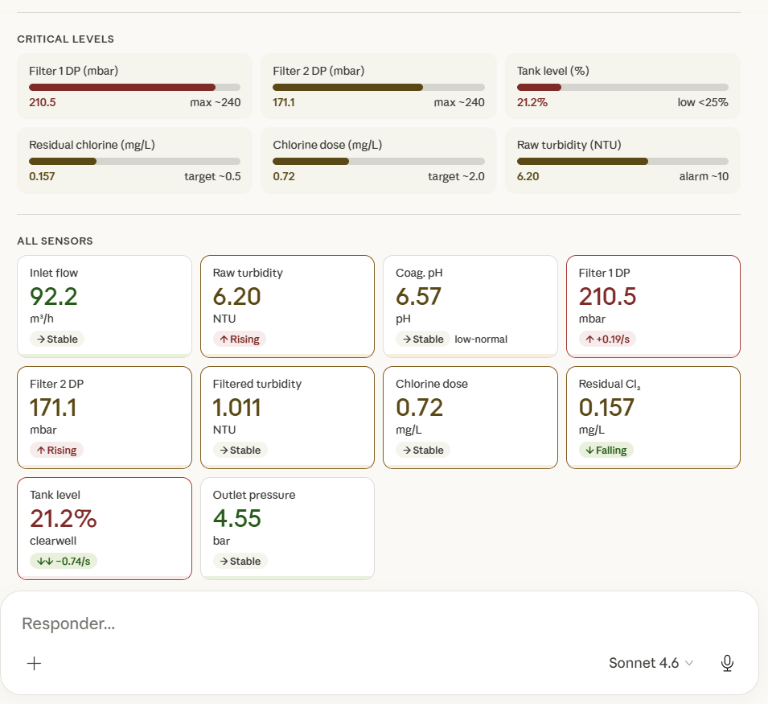

# Water Treatment Digital Twin — Starter Kit

<!--  -->


**[→ Live Demo](https://j03rul4nd.github.io/digital-twin-water/)** · Three.js · MQTT · No backend · No database · Runs entirely in the browser

---


## What is this

A starter kit that lets any developer spin up a **working digital twin of a water treatment plant in under 30 minutes** — with live sensor simulation, real-time 3D visualization, a rule engine with trend detection, webhook alerts, flexible payload mapping, Sparkplug B support, process KPIs, and Claude Desktop integration via MCP.

No Docker, no server, no auth. Fork it, swap in your sensors, connect your real MQTT broker.

---

## Quick Start

```bash
git clone https://github.com/j03rul4nd/digital-twin-water.git
cd digital-twin-water
npm install
npm run dev
```

Open [http://localhost:5173](http://localhost:5173) — the simulator starts immediately.

---

## Features

| Feature | Description |
|---|---|
| **3D visualization** | Procedural plant model. Meshes glow when alerts fire. ISA-101 color coding. |
| **Rule engine** | 15 rules evaluated every 500ms. Threshold + trend detection via linear regression. |
| **Alert history** | Resolved alerts move to History with duration and timestamp — not just a live list. |
| **Webhook alerts** | POST to Slack, Discord, n8n, Make, Zapier when alerts fire. Configured from UI. |
| **Payload mapping** | Auto-detect, flat, or custom field mapping. Connect any broker format without code. |
| **Sparkplug B** | Native Sparkplug B decode (Ignition, Cirrus Link, modern PLCs). No extra deps. |
| **Sensor history** | Click any sensor row for a live 3-minute chart with threshold reference lines. |
| **Incident simulator** | Trigger fault scenarios from the UI. 5 scenarios, 30s duration, auto-reset. |
| **Process KPIs** | Throughput, chlorination efficiency, time-in-warning, backwash count, and more. |
| **Claude Desktop** | MCP server lets Claude query sensor data, alerts, KPIs and trends in real time. |
| **UI-configurable** | Broker, credentials, webhooks, payload mapping — all from the dashboard, no code. |

---

## Connect your real MQTT broker

**1.** Click **`Configure & Connect →`** in the MQTT panel on the right side.

**2.** Fill in Broker URL, Username, Password, Plant ID → **`Test & Connect →`**

**3.** Publish to `wtp/plant/{plantId}/sensors`:

```json
{
  "timestamp": 1234567890123,
  "readings": {
    "inlet_flow": 142.3,
    "raw_turbidity": 4.2,
    "coag_ph": 7.1,
    "filter_1_dp": 98.0,
    "filter_2_dp": 102.5,
    "filtered_turbidity": 0.28,
    "chlorine_dose": 1.8,
    "residual_chlorine": 0.45,
    "tank_level": 67.0,
    "outlet_pressure": 4.2
  }
}
```

If your broker publishes a different format, click **`⇄ Payload`** to configure field mapping. Paste a sample message and the auto-analyzer suggests mappings for you.

### Sparkplug B

If your devices use Sparkplug B (Ignition, Cirrus Link, modern PLCs), the adapter detects it automatically from the topic pattern `spBv1.0/...` and decodes the Protobuf payload natively. No extra libraries, no configuration needed.

> Works with `ws://` and `wss://` brokers. For mutual TLS, you need a proxy — see [docs/mqtt-production.md](docs/mqtt-production.md).

Full setup guide: [docs/mqtt-production.md](docs/mqtt-production.md)

---

## Webhook alerts

Click **`⚡ Webhooks`** in the topbar to configure alert notifications.

| Event | Fires when |
|---|---|
| `alert.danger` | A danger-level alert activates |
| `alert.warning` | A warning-level alert activates |
| `alert.resolved` | Any alert clears |

Payload (verified working with webhook.site, Slack, Discord, n8n, Make):

```json
{
  "event": "alert.danger",
  "timestamp": 1774739174739,
  "plant": "plant-01",
  "alert": {
    "id": "chlorine_deficit",
    "severity": "danger",
    "sensorIds": ["inlet_flow", "chlorine_dose"],
    "message": "Chlorine dose not scaling with flow — disinfection deficit risk",
    "active": true
  }
}
```

Use the **Test →** button in the webhook form to verify your URL before saving.

---

## Claude Desktop integration

Connect Claude Desktop to query your plant in real time.

```bash
# Terminal 1 — dashboard
npm run dev

# Terminal 2 — MCP bridge
node mcp-bridge-server.js
```

Configure `claude_desktop_config.json`:

```json
{
  "mcpServers": {
    "wtp-digital-twin": {
      "command": "node",
      "args": ["/absolute/path/to/digital-twin-water/mcp-server.js"]
    }
  }
}
```

Then ask Claude things like:

- *"What's the current status of the water treatment plant?"*
- *"Are there any active danger alerts? What's causing them?"*
- *"What's the trend for filter_1_dp over the last 2 minutes?"*
- *"How efficient has the chlorination been? What's the throughput?"*




Full setup guide: [docs/claude-desktop-setup.md](docs/claude-desktop-setup.md)

---

## Adding your own alert rules

```js
// src/sensors/RuleEngine.js — add to RULES[]

// Threshold rule
{
  id: 'high_pressure', severity: 'warning',
  sensorIds: ['outlet_pressure'],
  message: 'Distribution pressure too high',
  condition: (readings) => readings.outlet_pressure > 6.5,
},

// Trend rule — linear regression over a time window
{
  id: 'pressure_rising', severity: 'warning',
  sensorIds: ['outlet_pressure'],
  message: 'Distribution pressure rising fast',
  condition: (readings, state) => {
    const trend = state.getTrend('outlet_pressure', 60); // last 60 seconds
    if (!trend || trend.samples < 10) return false;
    return trend.direction === 'rising' && trend.slope > 0.05;
  },
},
```

`getTrend()` returns `{ slope, delta, deltaRel, direction, samples, mean, first, last }`.

---

## Adding your own sensors

```js
// src/sensors/SensorConfig.js
{
  id: 'my_sensor', label: 'My Sensor', unit: 'bar',
  rangeMin: 0, rangeMax: 10,
  normal:  { low: 2, high: 8 },
  warning: { low: 1, high: 9 },
  danger:  { low: 0, high: 10 },
}

// src/sensors/SensorSceneMap.js
my_sensor: ['mesh_pump_station'],
```

---

## Architecture

```
sensor.worker.js  (Web Worker — isolated from render loop)
  │  500ms snapshots + 5 incident scenarios
  ▼
main.js → SensorState.update()     ← single source of truth + history buffer
        → EventBus.emit(SENSOR_UPDATE)
  │
  ├──▶ RuleEngine      threshold rules + trend rules (getTrend)
  │      └──▶ AlertPanel        active list + history section
  │      └──▶ AlertSystem       emissive glow on 3D meshes
  │      └──▶ WebhookManager    POST to configured URLs (text/plain, no preflight)
  │
  ├──▶ KPIEngine       throughput · chlorination eff · time-in-warning · backwashes
  │      └──▶ KPIPanel          modal with bar chart + stats grid
  │      └──▶ MCPBridge         push state to mcp-bridge-server every 1s
  │
  ├──▶ SceneUpdater    ColorMapper → mesh.material.color per tick
  └──▶ TelemetryPanel  rows → click → SensorDetailModal (live SVG chart)

MQTTAdapter  (real broker)
  │  topic = spBv1.0/... → SparkplugParser.parse() (Protobuf decode)
  │  topic = standard   → PayloadMapper.transform() (auto/flat/custom)
  └──▶ same SensorState → same pipeline → zero downstream changes

Claude Desktop ← mcp-server.js ← mcp-state.json ← mcp-bridge-server ← MCPBridge
```

---

## Sensors

| ID | Measurement | Unit | Stage |
|---|---|---|---|
| `inlet_flow` | Inlet Flow Rate | m³/h | Intake |
| `raw_turbidity` | Raw Water Turbidity | NTU | Intake |
| `coag_ph` | Coagulation pH | pH | Coagulation |
| `filter_1_dp` | Filter #1 Differential Pressure | mbar | Filtration |
| `filter_2_dp` | Filter #2 Differential Pressure | mbar | Filtration |
| `filtered_turbidity` | Filtered Water Turbidity | NTU | Post-filtration |
| `chlorine_dose` | Chlorine Dose | mg/L | Chlorination |
| `residual_chlorine` | Residual Chlorine | mg/L | Distribution |
| `tank_level` | Clearwell Tank Level | % | Storage |
| `outlet_pressure` | Distribution Pressure | bar | Distribution |

---

## Roadmap

**V1.1 ✅** Historical charts · Incident simulator · Trend detection

**V1.2 ✅** Webhook alerts · Flexible payload mapping

**V1.3 ✅** Sparkplug B · Process KPIs · Claude Desktop MCP integration

**V2.0 — Planned**
[`feature/ai-advisor`](../../tree/feature/ai-advisor): TinyLlama via WebLLM, natural language process diagnostics (~700MB, opt-in)

---

## Stack

| Layer | Tech | Why |
|---|---|---|
| Bundler | Vite | HMR without reloading WebGL |
| 3D | Three.js | WebGL2, procedural model, no assets |
| Realtime | Web Worker + MQTT.js | Worker isolates render loop |
| Protocols | MQTT + Sparkplug B | Native Protobuf decode, no extra deps |
| Map | Leaflet + OSM | Free, no API key |
| AI integration | MCP protocol | Claude Desktop reads live plant data |
| Deploy | GitHub Pages / Vercel | Static build, free |

---

## Built by

[Joel Benitez](https://joelbenitez.dev) · [LinkedIn](https://www.linkedin.com/in/joel-benitez-iiot-industry/) · [Medium](https://medium.com/@jowwii)

---

*Star the repo if this saved you from another heavyweight platform. Issues and PRs welcome.*