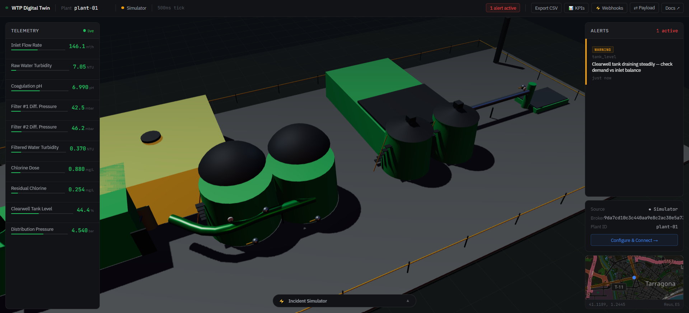
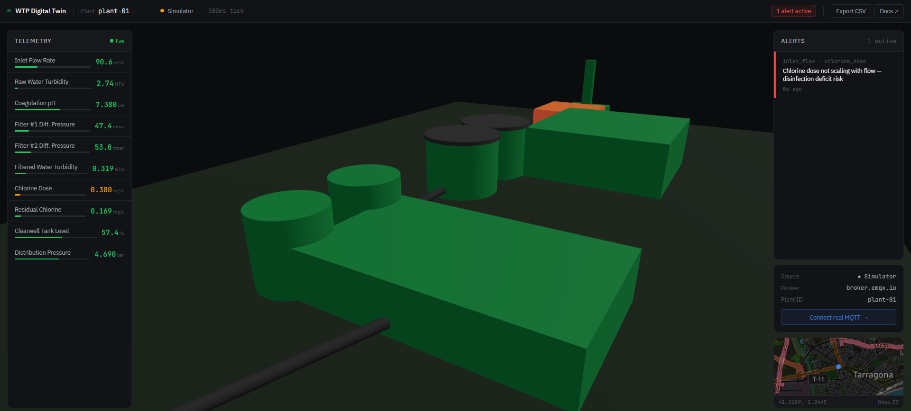

# Water Treatment Digital Twin — Starter Kit

<!-- GIF del dashboard funcionando va aquí — capturar con Filter #1 en rojo (estado más visual) -->
<!--  -->

**[→ Live Demo](https://j03rul4nd.github.io/digital-twin-water/)** · Three.js · MQTT · No backend · No database · Runs entirely in the browser

---


## What is this

A starter kit that lets any developer spin up a **working digital twin of a water treatment plant in under 30 minutes** — with live sensor simulation, real-time 3D visualization, and a rule engine that detects process anomalies. No Docker, no server, no auth.

Designed to live exactly between the repos that are too simple (just Three.js with no data) and the ones too complex (FUXA, ThingsBoard, iTwin.js). Fork it, swap in your sensors, connect your real MQTT broker.

---

## Quick Start

```bash
git clone https://j03rul4nd.github.io/digital-twin-water/
cd digital-twin-water
npm install
npm run dev
```

Open [http://localhost:5173](http://localhost:5173) — the simulator starts immediately.

---

## Connect your real MQTT broker

The simulator runs out of the box. When you're ready to connect real data:

**1. Click "Connect real MQTT →"** in the dashboard panel — it connects to `broker.emqx.io` by default for testing.

**2. Publish your sensor data** to the topic `wtp/plant/{plantId}/sensors` in this format:

```json
{
  "timestamp": 1234567890123,
  "readings": {
    "inlet_flow": 142.3,
    "raw_turbidity": 4.2,
    "coag_ph": 7.1,
    "filter_1_dp": 98.0,
    "filter_2_dp": 102.5,
    "filtered_turbidity": 0.28,
    "chlorine_dose": 1.8,
    "residual_chlorine": 0.45,
    "tank_level": 67.0,
    "outlet_pressure": 4.2
  }
}
```

**3. To use your own broker**, edit the URL in `src/ui/MQTTPanel.js`:

```js
_buildBrokerUrl() {
  return 'ws://your-broker:8083/mqtt'; // or wss:// for secure
}
```

> **Note:** Works with brokers configured for `ws://` or `wss://` with simple credentials. For installations with mutual TLS (client certificates), you need an intermediate proxy — see [docs/mqtt-production.md](docs/mqtt-production.md).

For a full Python example publishing from a real installation: [docs/mqtt-production.md](docs/mqtt-production.md)

---

## Adding your own sensors

Open `src/sensors/RuleEngine.js` and add an object to the `RULES` array:

```js
{
  id:        'my_custom_rule',         // unique — used for deduplication
  severity:  'warning',               // 'warning' | 'danger'
  sensorIds: ['inlet_flow'],          // which meshes to highlight in the 3D scene
  message:   'Inlet flow too high for current capacity',
  condition: (readings) => readings.inlet_flow > 210,
}
```

That's it. The rule engine evaluates every 500ms. When the condition is true, the alert appears in the panel and the corresponding 3D mesh starts glowing.

To add a new sensor with its own display range and thresholds, add an entry to `src/sensors/SensorConfig.js`:

```js
{
  id:      'my_sensor',
  label:   'My Sensor',
  unit:    'bar',
  rangeMin: 0,
  rangeMax: 10,
  normal:  { low: 2, high: 8 },
  warning: { low: 1, high: 9 },
  danger:  { low: 0, high: 10 },
}
```

Then bind it to a 3D mesh in `src/sensors/SensorSceneMap.js`:

```js
my_sensor: ['mesh_pump_station'],
```

---

## Architecture

```
sensor.worker.js  (Web Worker — isolated from render loop)
  │  generates complete snapshot every 500ms
  │  { timestamp, readings: { all sensors } }
  │  postMessage → main thread
  ▼
main.js → SensorState.update()        ← single source of truth
        → EventBus.emit(SENSOR_UPDATE)
  │
  ├──▶ RuleEngine      evaluates RULES[], manages alert lifecycle
  │      └──▶ EventBus.emit(RULE_TRIGGERED, { active: true/false })
  │              ├──▶ AlertPanel    updates alert list in UI
  │              └──▶ AlertSystem   applies emissive glow to 3D meshes
  │
  ├──▶ SceneUpdater    ColorMapper → mesh.material.color
  └──▶ TelemetryPanel  sensor rows with live values and progress bars

MQTTAdapter  (when user connects real broker)
  │  same payload shape as Worker
  │  main.js pauses Worker on MQTT_CONNECTED
  └──▶ same SensorState → same EventBus → zero changes downstream
```

Key design decisions:

- **No framework** — plain ES Modules and classes. Maximum readability for forks.
- **Worker isolation** — the Three.js render loop never competes with sensor simulation.
- **Observable adapter** — `MQTTAdapter` emits 4 lifecycle events. Swap in any data source without touching the rest of the system.
- **Deterministic rule engine** — zero download, zero latency. Rules are plain JS objects with a `condition()` function.
- **Color as signal** — ISA-101 compliant. `--green`/`--amber`/`--red` are exclusively for process state. When something is colored, it means something.

---

## Sensors

| ID | Measurement | Unit | Stage |
|---|---|---|---|
| `inlet_flow` | Inlet Flow Rate | m³/h | Intake |
| `raw_turbidity` | Raw Water Turbidity | NTU | Intake |
| `coag_ph` | Coagulation pH | pH | Coagulation |
| `filter_1_dp` | Filter #1 Differential Pressure | mbar | Filtration |
| `filter_2_dp` | Filter #2 Differential Pressure | mbar | Filtration |
| `filtered_turbidity` | Filtered Water Turbidity | NTU | Post-filtration |
| `chlorine_dose` | Chlorine Dose | mg/L | Chlorination |
| `residual_chlorine` | Residual Chlorine | mg/L | Distribution |
| `tank_level` | Clearwell Tank Level | % | Storage |
| `outlet_pressure` | Distribution Pressure | bar | Distribution |

---

## Roadmap

- **V1.1** — Historical charts per sensor, incident simulation mode, trend detection in rule engine
- **V2.0** — [`feature/ai-advisor`](../../tree/feature/ai-advisor) branch: TinyLlama via WebLLM for natural language process diagnostics (opt-in, ~700MB download cached in IndexedDB)

---

## Stack

| Layer | Tech | Why |
|---|---|---|
| Bundler | Vite | HMR without reloading WebGL. Static build to `dist/`. |
| 3D | Three.js | WebGL2. Procedural model — no external assets, no license ambiguity. |
| Realtime | Web Worker + MQTT.js | Worker protects the render loop. MQTT.js for broker connection. |
| Map | Leaflet + OSM | Free forever. No API key. |
| Deploy | GitHub Pages / Vercel | Static build. Free, no VPS. |

---

## Built by

[Joel Benitez](https://joelbenitez.dev) · [LinkedIn](https://www.linkedin.com/in/joel-benitez-iiot-industry/) · [Medium](https://medium.com/@jowwii)

---

*Star the repo if this saved you from another heavyweight platform. Issues and PRs welcome.*